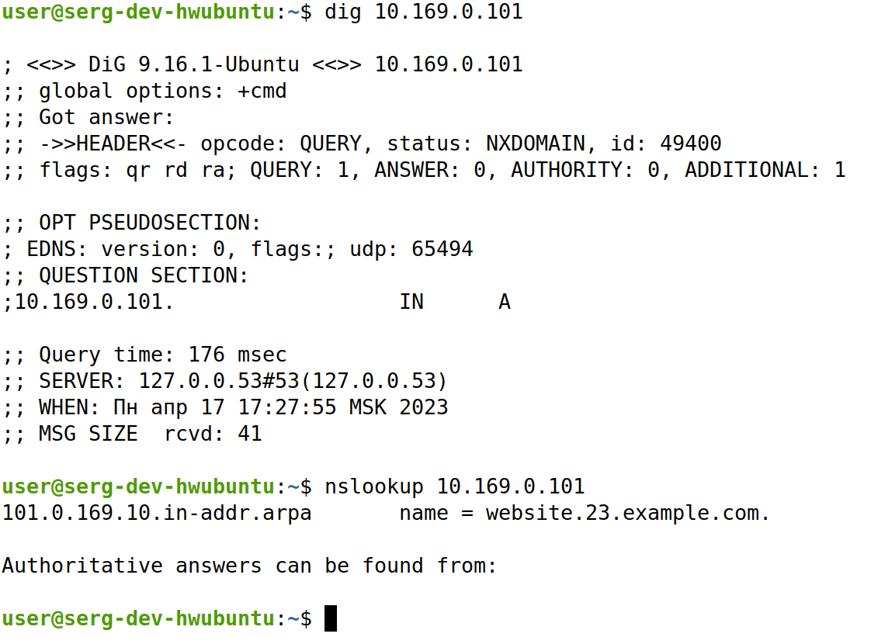
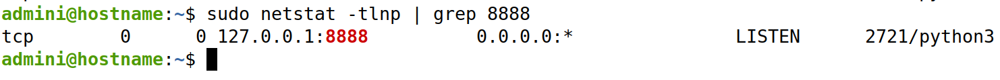

# Инфраструктурные сервисы
В данной лекции рассматривается необходимость и принцип работы сервисов dhcp, dns, ssh, ldap, radius

## Условия задачи
    Поднять BIND в качестве авторитетного DNS сервера для своей зоны и резолвера для всех остальных запросов.
    Сделать так, чтобы доменные имена из прошлого задания (test.website.23.example.com и stage.website.23.example.com) были отрезолвлены этим DNS сервером
    Перенастроить NGINX и слушать сокет 127.0.0.1:80 и 127.0.0.1:443
    При помощи ssh сделать так, чтобы запросы в localhost:8888 на ноутбуке были отправлены и обработаны nginx на порту 443 на сервере
    Поднять openLDAP сервер на сервере (как бы странно это не звучало), добавить в него данные
или так

    Ставим BIND
    Создаем файлик авторитетной зоны для .example.com
    Создаем необходимые A записи
    Создаем файлик для обратной зоны и добавляем туда необходимые записи
    Перенастраиваем у себя на компе DNS, чтобы он смотрел на наш сервер, проверяем, что имена резолвятся.
    Для запросов любых других записей, форвардить их в 8.8.8.8
    После того, как проверили работоспособность DNS и продемонстрировали ее, переходим к работе с ssh туннелями
    Делаем local forward туннель с указанными в задании параметрами (запросы в localhost:8888 на ноутбуке были отправлены и обработаны nginx на порту 443 на сервере)
    Поднимаем OpenLDAP сервер. Пробуем настраиваем db.ldif
    Генерируем пароль при помощи slappasswd
    Создаем файлик db.ldif

## Решение 

1) Установить bind9

2) Настройка авторитарной зоны для website.23.example.com и для обратной зоны. При вводе 
`sudo nano /etc/bind/named.conf.local` получаем такой вывод:
```
zone "website.23.example.com" {
     type master;
     file "/etc/bind/db.website.23.example.com";
};

zone "157.137.79.in-addr.arpa" {
    type master;
    file "/etc/bind/79.137.157.rev";
};
```

3) Настраиваем конфиг бинда для правильной работы. Файл `/etc/bind/named.conf.options` в BIND9 содержит настройки опций для DNS-сервера, которые необходимы для его корректной работы. Вводим `sudo nano /etc/bind/named.conf.options`
```
        listen-on { any; };
        allow-query { any; };
        auth-nxdomain no;
        forwarders {
                8.8.8.8;
        };
```
4) Создаем два файла зоны. Первая для website.23.example.com. Вторая для реверс зоны. Файл зоны DNS (DNS zone file) - это текстовый файл, содержащий записи о доменном имени и его поддоменах, которые используются для перевода доменного имени в соответствующий IP-адрес и для обратного перевода IP-адреса в доменное имя. Файл зоны DNS включает в себя записи о ресурсных записях (Resource Records, RR) для каждого доменного имени в зоне. Эти записи определяют типы данных, связанных с каждым доменным именем, например, IP-адрес для доменного имени. Некоторые общие типы RR включают в себя:
- A записи, которые связывают доменное имя с IPv4-адресом
- AAAA записи, которые связывают доменное имя с IPv6-адресом
- CNAME записи, которые создают псевдонимы для доменных имен
- MX записи, которые определяют почтовые сервера, обслуживающие доменное имя
- NS записи, которые определяют имена серверов, ответственных за зону

Обратные зоны DNS (reverse DNS zones) используются для выполнения обратного поиска имени хоста по IP-адресу. Это позволяет связать IP-адрес с конкретным доменным именем, облегчая идентификацию устройства в сети. Обратные зоны DNS работают в противоположность передним зонам DNS (forward DNS zones), которые связывают доменные имена с IP-адресами

Вводим `sudo nano /etc/bind/db.website.23.example.com` и получаем 
```
$TTL 86400
@       IN      SOA     ns1.website.23.example.com. admin.website.23.example.com. (
            1        ; Serial
            3600     ; Refresh
            1800     ; Retry
            604800   ; Expire
            86400 )  ; Minimum TTL
;
@       IN      NS      ns1.website.23.example.com.
@       IN      A       10.169.0.101
ns1     IN      A       10.169.0.101
test    IN      A       10.169.0.101
stage   IN      A       10.169.0.101
```

И реверс-зона `sudo nano /etc/bind/79.137.157.rev`
```
$TTL    86400
@       IN      SOA     ns1.website.23.example.com. admin.website.23.example.com. (
                2023041501      ; Serial
                3600            ; Refresh
                1800            ; Retry
                604800          ; Expire
                86400           ; Minimum TTL
                )
@       IN      NS      ns1.website.23.example.com.
23      IN      PTR     website.23.example.com.
```

5) Перезапускаем bind9 `sudo systemctl restart bind9`

6) Проверяем правильность всех конфигов
- `sudo named-checkconf`
- `sudo named-checkzone website.23.example.com /etc/bind/db.website.23.example.com`
- `sudo named-checkzone 157.137.79.in-addr.arpa /etc/bind/79.137.157.rev`
7) Настройка ***/etc/hosts*** на ноуте. Файл ***/etc/hosts*** - это текстовый файл в операционной системе Linux (и не только), который содержит список локальных сетевых узлов и их IP-адресов. 
```
sudo nano /etc/hosts
10.169.0.101    website.23.example.com
```
А также настроить /etc/resolv.conf. Файл /etc/resolv.conf - это конфигурационный файл, который используется для настройки системы на получение информации о DNS-серверах и поиска доменных имен в локальной сети. Когда вы пытаетесь подключиться к удаленному ресурсу по имени, ваш компьютер использует DNS-сервер, чтобы определить IP-адрес, связанный с этим именем. Файл /etc/resolv.conf содержит информацию о DNS-серверах, которые ваш компьютер должен использовать для выполнения DNS-запросов. Файл /etc/resolv.conf также содержит информацию о доменных именах, которые нужно искать в локальной сети. Если вы пытаетесь подключиться к удаленному ресурсу, используя короткое имя хоста, ваш компьютер может добавить доменное имя из файла /etc/resolv.conf к имени хоста для выполнения поиска в локальной сети. 
```
sudo nano /etc/resolv.conf
nameserver 10.169.0.101
search website.23.example.com
```
8) Тестим с локального компа ***dig IP*** / ***nslookup IP***. Видим там:


9) Настраиваем local forward tunel чтобы запросы в localhost:8888 на ноутбуке были отправлены и обработаны nginx на порту 443 на сервере
`ssh -L 8888:localhost:443 admini@10.169.0.101`

10) Переконфигурируем nginx для прослушивания сокетов 127.0.0.1:80 и 127.0.0.1:443 на сервере
    1) Откройте конфигурационный файл nginx, который находится по пути `/etc/nginx/nginx.conf` на сервере, используя любой текстовый редактор
    2) Найдите блок server, который соответствует порту 80 и 443, и замените строку listen на следующую
    ```
    listen 127.0.0.1:80;
    listen 127.0.0.1:443 ssl;
    ```
    3) Проверьте правильность конфигурации `sudo nginx -t`
    4) Перезапустите nginx: `sudo nginx -s reload`

11) Запустить скрипт питона в detached mode `nohup python3 app.py &`

12) Убедитесь, что NGINX на сервере запущен и слушает порт 443. Для этого вы можете выполнить команду: `sudo netstat -tlnp | grep 8888`


13) Работа с openldap
    1) Установка `sudo apt install slapd ldap-utils`
    2) Конфигурирование `sudo dpkg-reconfigure slapd`. Данная команда используется для перенастройки пакета OpenLDAP сервера директорий (slapd). Она запускает интерактивный процесс настройки slapd с использованием dpkg-reconfigure. Dpkg-reconfigure - это инструмент, который предоставляет интерфейс командной строки для перенастройки уже установленных пакетов Debian. 
    Во время этого процесса вы можете изменить настройки конфигурации, такие как базовый DN (Distinguished Name), используемые протоколы аутентификации и другие параметры
    - Тип базы данных - вы можете выбрать между базой данных BDB, HDB и MDB.
    - Путь к каталогу с данными - это место, где будут храниться данные сервера slapd.
    - Базовый DN - это базовое имя, используемое для поиска в дереве каталога LDAP.
    - Пароль администратора - это пароль администратора сервера slapd.
    
    3) Конфигурирование файла для клиентов LDAP `sudo nano /etc/ldap/ldap.conf`. В этом файле хранятся настройки для доступа к серверу LDAP, такие как адрес сервера, порт, протокол, базовый DN и другие параметры.
    ```
    #
    # LDAP Defaults
    #

    # See ldap.conf(5) for details
    # This file should be world readable but not world writable.

    BASE    dc=website.23.example,dc=com
    URI     ldap://ldap-srvl.website.23.example.com
    #ldap://ldap-master.example.com:666

    #SIZELIMIT      12
    #TIMELIMIT      15
    #DEREF          never

    # TLS certificates (needed for GnuTLS)
    TLS_CACERT      /etc/ssl/certs/ca-certificates.crt
    ```
    4) Поиск в дереве каталога LDAP на сервере, используя учетные данные внешнего доступа `sudo ldapsearch -Q -LLL -Y EXTERNAL -H ldapi:/// -b dc=website,dc=23,dc=example,dc=com dn`
    - "-Q" - выключает интерактивный режим и не запрашивает пароль у пользователя
    - "-LLL" - форматирует вывод в простой формат без заголовков и других метаданных
    - "-Y EXTERNAL" - указывает механизм аутентификации EXTERNAL, который используется для аутентификации клиента LDAP с помощью сертификата, вместо пароля
    - "-H ldapi:///" - указывает протокол и адрес сервера LDAP, который используется для выполнения поиска
    - "-b dc=website,dc=23,dc=example,dc=com" - задает базовый DN (Distinguished Name) для поиска в дереве каталога LDAP.

    Команда ldapsearch выполнит поиск в дереве каталога LDAP на сервере, начиная с базового DN, указанного в параметре "-b", и вернет только DN (Distinguished Name) каждой записи, которая соответствует условиям поиска. В данном случае команда ищет все записи в дереве каталога LDAP, начиная с базового DN "dc=website,dc=23,dc=example,dc=com" и возвращает только их DN.

    Параметр "-Y EXTERNAL" означает, что клиент аутентифицируется на сервере LDAP с помощью сертификата, а не пароля. Таким образом, команда ldapsearch не будет запрашивать пароль у пользователя, а использовать авторизацию на основе сертификата.

    На выводе получим:
    ```
    dc=website,dc=23,dc=example,dc=com dn

    dn: dc=website,dc=23,dc=example,dc=com
    dn: cn=admin,dc=website,dc=23,dc=example,dc=com
    ```

    Можно еще эти команды потестить 
    - `sudo ldapsearch -Q -LLL -Y EXTERNAL -H ldapi:/// -b cn=config dn`
    - `sudo ldapsearch -Q -LLL -Y EXTERNAL -H ldapi:/// -b dc=website,dc=23,dc=example,dc=com dn`

    5) Добавляем деревья `sudo nano /etc/ldap/add_persons.ldif`
    ```
    dn: ou=People,dc=website,dc=23,dc=example,dc=com
    objectClass: organizationalUnit
    ou: People

    dn: ou=Groups, dc=website, dc=23,dc=example,dc=com
    objectClass: organizationalUnit
    ou: Groups

    dn: cn=IT, ou=Groups, dc=website, dc=23,dc=example,dc=com
    objectclass: posixGroup
    cn: IT
    gidNumber: 5000

    dn: cn=Marketing, ou=Groups, dc=website, dc=23,dc=example,dc=com
    objectClass: posixGroup
    cn: Marketing
    gidNumber: 6000

    dn: uid=sergey,ou=People,dc=website,dc=23,dc=example,dc=com
    objectClass: inetOrgPerson
    objectclass: posixAccount
    objectclass: shadowAccount
    uid: sergey
    sn: markin
    givenName: Sergey
    cn: Sergey Markin
    displayName: Sergey Markin
    uidNumber: 10000
    gidNumber: 5000
    userPassword: {CRYPT}x
    gecos: Sergey Markin
    loginShell: /bin/bash
    homeDirectory: /home/sergey
    ```

    Эти команды представляют LDIF (LDAP Data Interchange Format) записи, используемые для создания двух новых organizationalUnit (OU) в дереве каталога LDAP.

    Первая запись создает новую OU с DN (Distinguished Name) "ou=People,dc=website,dc=23,dc=example,dc=com", используя два атрибута objectClass и ou. Атрибут objectClass определяет тип объекта LDAP, который создается, а атрибут ou задает название OU.

    Аналогично вторая и третья.
    
    Таким образом, выполнение этих команд создаст новые organizationalUnit в дереве каталога LDAP, которые могут быть использованы для организации данных в дереве каталога LDAP.


