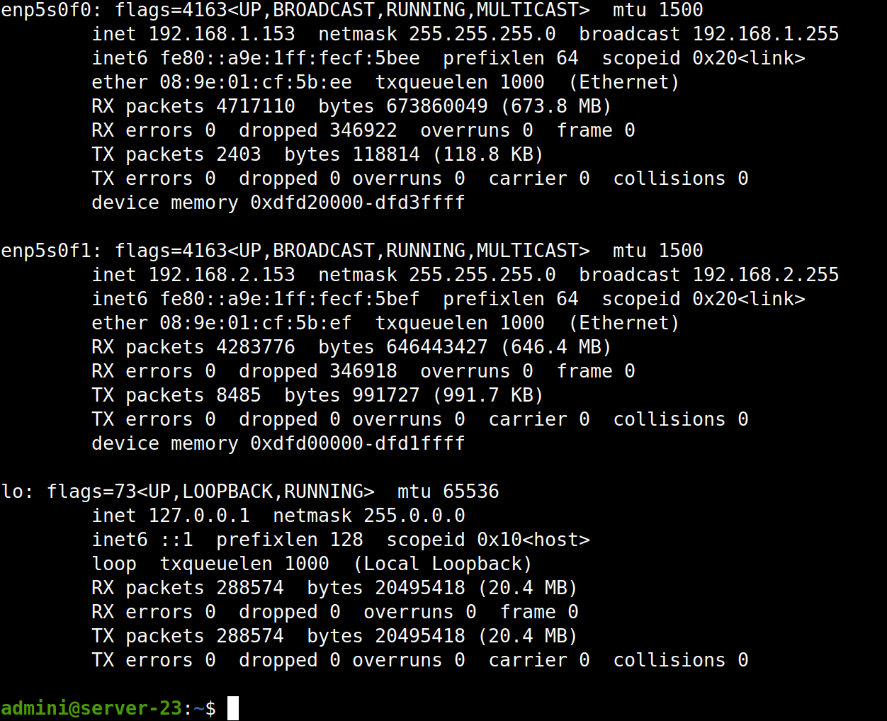
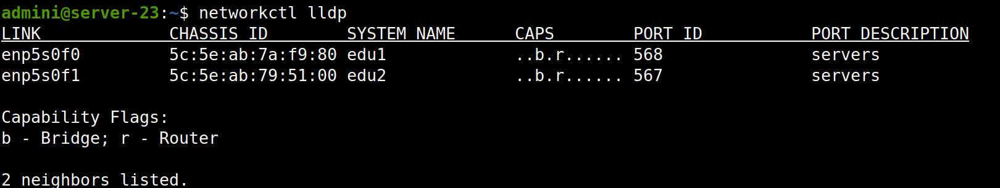
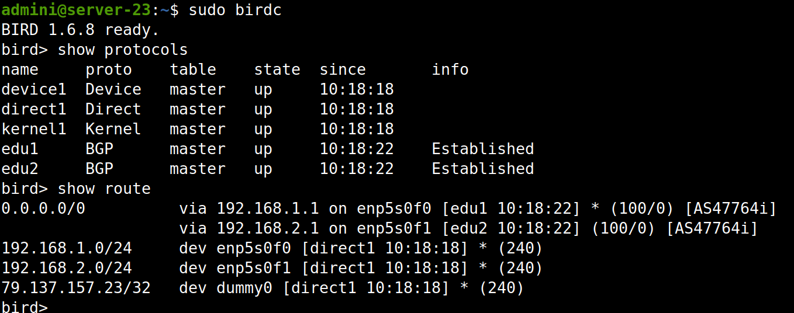
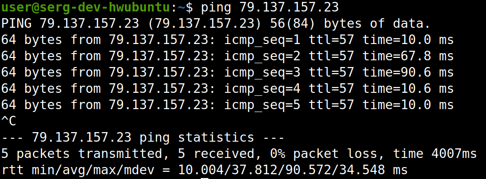

# Занятие 2 - Основы сетей передачи данных
## Задание
1) Зайти на сервер, используя преднастроенный IP адрес IPMI интерфейса:
192.168.3.X (маска /24, шлюз 192.168.3.1), где Х - номер сервера (2,3,4...).
2) Проверить, что оба физических интерфейса сервера находятся в статусе UP.
3) Используя LLDP, определить к какому из коммутаторов (edu1 или edu2)
подключен конкретный физический порт на сервере.
4) Настроить IP адреса (перманентно) на 3х интерфейсах сервера, где Х - номер сервера (2,3,4...):
a) Физический интерфейс подключенный к коммутатору edu1: 192.168.1.X/24
b) Физический интерфейс подключенный к коммутатору edu2: 192.168.2.X/24
c) Виртуальный интерфейс (VIP/dummy0): 79.137.157.X/32
5) Используя Bird, установить BGP сессии с коммутаторами edu1 и edu2
a) edu1 и edu2 BGP AS - 65530
b) BGP AS сервера - 65530
с) edu1 IP: 192.168.1.1
d) edu2 IP: 192.168.2.1
6) Используя BGP, проанонсировать VIP (dummy0) адрес в сторону коммутаторов
и принять от них default route.
7) Используя ping, убедиться, что VIP адрес сервера остается доступен,
если выключить один из физических интерфейсов сервера,
сымитировав аварийную ситуацию выхода из строя одного из коммутаторов.
8) Включить физический интерфейс сервера (отключенный на этапе 7) и убедиться,
что BGP сессия с коммутатором восстановилась

## Решение поставленных задач
1) Зашел через докер
2) команда `ifconfig -a` показывает: 



3) команда `networkctl lldp` показывает:



4) в директории /etc/systemd/network должно находиться 3 файла. Нейминг должен соблюдаться по номерам, это особенность пакета bird 
- 00-eth1.network  
- 10-eth1.network  
- 20-dummy.netdev

Директория /etc/systemd/network содержит конфигурационные файлы для настройки сетевых интерфейсов с помощью системы инициализации systemd.

Чтобы добавить новый интерфейс, вам нужно создать новый файл конфигурации в этой директории. Имя файла должно иметь расширение .network.

Внутри файла конфигурации вы должны указать настройки для нового интерфейса. Например, вот как выглядит простой файл конфигурации для настройки интерфейса сети с помощью DHCP:
```
[Match]
Name=en*

[Network]
DHCP=...
```
В приведенном выше примере [Match] определяет, какой интерфейс сети мы хотим настроить. В данном случае мы выбрали интерфейсы, имена которых начинаются с "en" (ethernet). [Network] определяет настройки сети для интерфейса, в данном случае мы указываем, что мы хотим использовать DHCP для получения IP-адреса.


команда `sudo ls /etc/systemd/network` выводит:
``` 
00-eth1.network  10-eth1.network  20-dummy.netdev
```

`sudo nano /etc/systemd/network/00-eth1.network`
```
[Match]
Name=enp5s0f0
[Network]
Address=192.168.1.23/24
```
`sudo nano /etc/systemd/network/10-eth1.network`
```
[Match]
Name=enp5s0f1
[Network]
Address=192.168.2.23/24
```
`sudo nano /etc/systemd/network/20-dummy.netdev`
```
[NetDev]
Name=dummy0
Kind=dummy
[Address]
Address=79.137.157.23/32
```

После чего перезагружаем сетевую службу `sudo systemctl restart systemd-networkd`

5) Вводим `sudo nano /etc/bird/bird.conf`
```
router id 79.137.157.23;
protocol device {
    scan time 10;
}
protocol direct {
}

protocol kernel {
    import all;
    export all;
}

protocol bgp edu1 {
    local 192.168.1.23 as 65530;
    neighbor 192.168.1.1 as 65530;
    import all;
    export all;
}

protocol bgp edu2 {
    local 192.168.2.23 as 65530;
    neighbor 192.168.2.1 as 65530;
    import all;
    export all;
}
```

После чего перезагружаем bird 
`sudo systemctl restart bird`

6) 
- `sudo birdc` 

BIRD - это программное обеспечение, которое выполняет протокол маршрутизации для IP-сетей. С помощью интерактивной оболочки birdc можно управлять конфигурацией маршрутизатора BIRD, проверять текущее состояние маршрутизации и выполнять различные действия, связанные с управлением маршрутизацией.

Команда `sudo birdc` запускает интерактивную оболочку birdc с привилегиями суперпользователя, что может потребоваться для выполнения определенных задач, например, изменения конфигурации маршрутизатора. После запуска оболочки можно вводить различные команды для управления маршрутизатором BIRD.

- `show protocols`

Команда используется в интерактивной оболочке управления BIRD (birdc) для отображения текущего состояния протоколов маршрутизации, настроенных на маршрутизаторе BIRD.

После ввода команды в birdc будут отображены все протоколы маршрутизации, которые настроены в текущей конфигурации BIRD. Для каждого протокола будут отображены различные параметры, такие как его состояние (включен/выключен), тип протокола, используемый адрес и порт, таблица маршрутизации, используемая протоколом, и другая информация

`show route`

Команда используется в интерактивной оболочке управления BIRD (birdc) для отображения текущей таблицы маршрутизации, которую использует маршрутизатор BIRD.

После ввода команды в birdc будут отображены все маршруты, которые находятся в таблице маршрутизации маршрутизатора BIRD. Для каждого маршрута будут отображены различные параметры, такие как сеть, для которой задан маршрут, метрика маршрута, тип маршрута, используемый протоколом маршрутизации и другая информация.




7) `ping 79.137.157.23` с локального компа для проверки отправки пакетов на сервер



8) Опустить интерфейс можем командой `sudo ifconfig enp5s0f0 down`