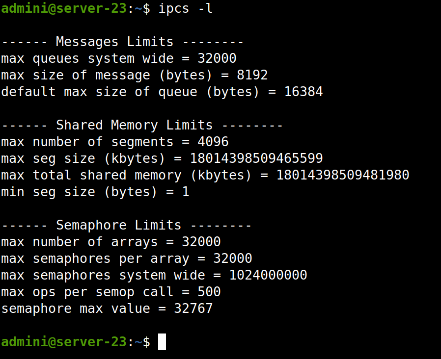

# Проанализируйте вывод “ipcs -l” , определите соответствуют ли текущие параметры с ресурсами платформы

Команда `ipcs -l` выводит информацию о параметрах совместного использования системных ресурсов IPC. Параметры, которые можно увидеть:
- `max seg size` - максимальный размер сегмента разделяемой памяти в байтах
- `max total shared memory` - максимальный общий размер разделяемой памяти в байтах
- `max queues system wide` - максимальное число очередей сообщений в системе
- `max messages per queue` - максимальное число сообщений в очереди

