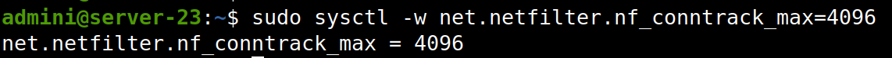

# Измените  параметры ядра в части модуля netfilter. Максимальное количество соединений 4096

1. `sudo nano /etc/sysctl.conf`
2. добавить в конец файла `net.netfilter.nf_conntrack_max = 4096`. Параметр nf_conntrack_max отвечает за максимальное количество соединений, которое может быть отслеживаемым в netfilter connection tracking system. Оно отслеживает соединения на сетевом уровне и используется для реализации функций firewall, NAT .....
3. ???????????????????
 `sudo sysctl -p`

 
